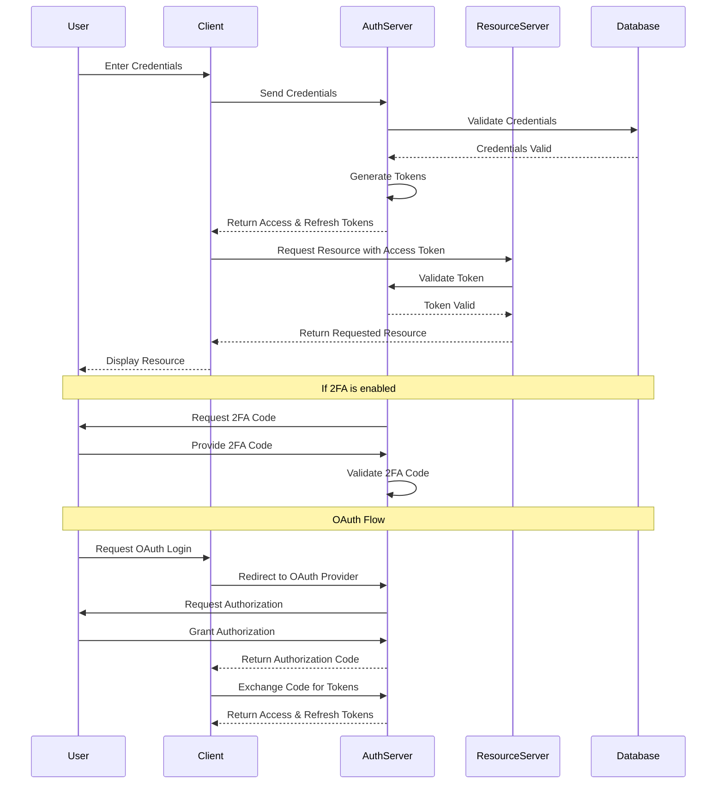

# Authentication Flow Diagram

This diagram illustrates the basic flow of the authentication process in our system.

This diagram shows the following key steps:

1. User enters credentials in the client application.
2. Client sends credentials to the authentication server.
3. Auth server validates credentials against the database.
4. If valid, auth server generates access and refresh tokens.
5. Client receives tokens and uses the access token to request resources.
6. Resource server validates the token with the auth server before serving the resource.
7. If 2FA is enabled, there's an additional step for 2FA code validation.
8. For OAuth flow, there are additional steps involving user authorization and code exchange.

Note: This is a simplified representation. Actual implementation may involve additional steps and security measures.
